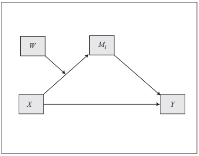
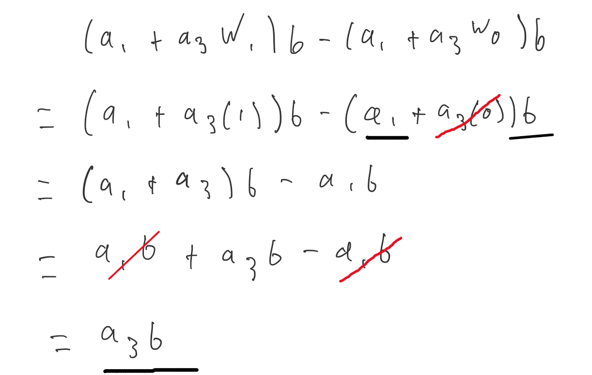

## Setup

```{r setup, include=FALSE}
knitr::opts_chunk$set(echo = TRUE)
options(scipen = 999)
```

```{r, message=FALSE, warning=FALSE}
library(tidyverse)
library(lavaan)
library(knitr)
```

```{r}
df <- read.csv("../Data/EmergingAdulthoodData.csv")
```

## Model

We are testing to see whether the relationship between perceived stress and self-efficacy is mediated by subjective well being. Additionally, We want to know if perceived social support from family moderates the relationship between stress and subjective well being.

Here is our model:

-   IV: Stress
-   Mediator: Subjective Well Being
-   DV: Self-efficacy
-   Moderator: Social Support from Family

Below is a theoretical drawing of our model. As you can see, our moderator only has an interaction effect on the relationship between the IV and the mediator (i.e., the *a* path).

```{r, echo=FALSE, fig.cap="Model 7", out.width="50%", fig.align='center'}

```

## Data

I am just selecting the scales we need for the analysis in a new data frame. Additionally, I also renamed the variables to x, M, y, and W. While this is unnecessary, it makes writing the equations in the next step a little simpler.

```{r}
dat <- df |>
  select(Stress, 
         SWBscale, 
         EfficacyScale, 
         PSS_Family) |> 
  rename(x = Stress,
         M = SWBscale,
         y = EfficacyScale,
         W = PSS_Family)

dat$xW <- dat$x*dat$W
```

## Fit Model

Now we need to fit our model in lavaan. We are going to end up with a total of 6 equations. 

The first two will represent our model:

a path: $M = a_1x + a_2W + a_3Wx$
b path: $y = bM + c'x$

The third equation is for the index of moderated mediation. To find this equation, we take the difference of the conditional direct effect of x on y for a one unit difference in the moderator. For Hayes model 7, the conditional indirect effect is $M = (a_1 + a_2W)b$.


$$(a_1 + a_3*W_1)*b - (a_1 + a_3*W_0)*b$$

```{r, echo=FALSE, out.width="50%", fig.align='center'}

```

After solving this expression, we find that our index of moderated mediation is:

- $a_3b$.

Finally, we want to probe the conditional indirect effects for the moderator at the mean, +1 SD, and -1 SD.

- $(a_1 + a_2 * (mean - sd)) * b$
- $(a_1 + a_2 * mean) * b$
- $(a_1 + a_2 * (mean + sd)) * b$

Now we can write out our equations in lavaan!

```{r}
model <- "

# Model Equations

M ~ a1*x + a2*W + a3*xW
y ~ b*M + c.p*x

# Index of Moderated Mediation

imm := a3*b

# Mean and Variance

W ~ W.mean*1
W ~~ W.var*W

# Conditional Effects

con_low := (a1 + a2 * (W.mean - sqrt(W.var))) * b
con_mean := (a1 + a2 * W.mean) * b
con_high := (a1 + a2 * (W.mean + sqrt(W.var))) * b

"
```

```{r}
fit <- sem(model, data = dat, missing = "listwise", se = "standard")

summary(fit, rsq = T, ci = TRUE) # add fit=TRUE t0 see fit statistics of the model
```


## Results

### Regression Paths 

- **a path**: Significant effect of stress on well being $b = -1.17, p < .001, 95\%\ CI [-1.23, -1.11]$
- **moderation**: Significant interaction effect of stress and social support on well being $b=0.04, p < .001, 95\%\ CI [0.03, 0.05]$
- **b path**: Significant effect of well being on self-efficacy $b = 0.08, p < .001, 95\%\ CI [0.07, 0.10]$
- **c' path**: Significant effect of stress on self-efficacy $b = -0.18, p < .001, 95\%\ CI [-0.21, -0.16]$

### R-squared

- **model predicting mediator**: $R^2 = .34$
- **model predicting DV**: $R^2 = .20$

### Index of Moderated Mediation

- **imm**: Significant index of moderated mediation $b = 0.003, p < .001, 95\%\ CI [0.003, 0.004]$

### Conditional Effects

- **conditional low**: $b = -0.05, p < .001, 95\%\ CI [-0.06, -0.04]$
- **conditional mean**: $b = -0.03, p < .001, 95\%\ CI [-0.04, -0.02]$

